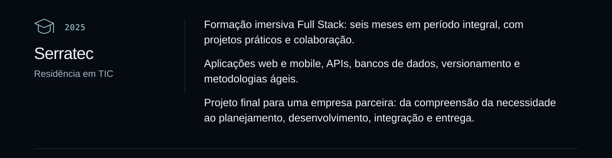
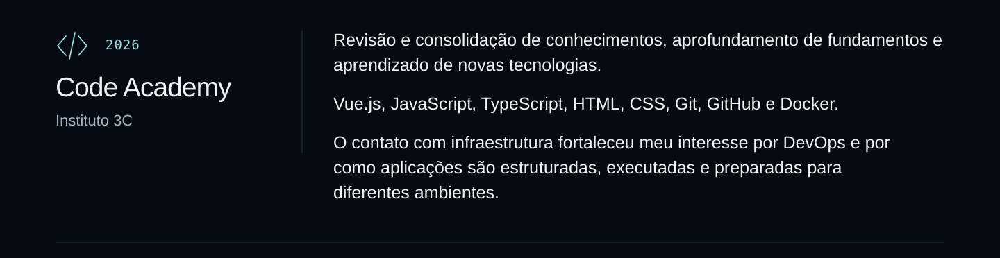
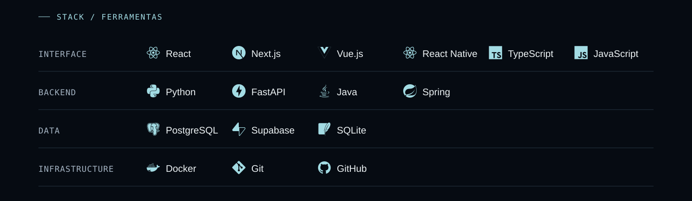

<picture>
  <source media="(max-width: 600px)" srcset="./assets/horizonte/hero-mobile.svg">
  
</picture>

<picture>
  <source media="(max-width: 600px)" srcset="./assets/horizonte/about-heading-mobile.svg">
  
</picture>

Sou **Fernando Henrique Campos**, Desenvolvedor **Full Stack Trainee na Michelc Assessoria Contábil** e estudante de **Tecnologia em Sistemas para Internet na UTFPR**.

Minha trajetória combina formação intensiva, aprofundamento técnico contínuo e experiência profissional construindo soluções para necessidades reais de empresas. Trabalho com aplicações web, APIs, bancos de dados, autenticação, controle de acesso, automações e regras de negócio — da compreensão do problema à arquitetura, ao desenvolvimento, aos testes e à evolução dos sistemas.

 

<picture>
  <source media="(max-width: 600px)" srcset="./assets/horizonte/focus-mobile.svg">
  
</picture>

English introduction

I am a **Full Stack Developer Trainee at Michelc Assessoria Contábil** and an **Internet Systems student at UTFPR**. I build web applications, APIs and automations, contributing from requirements and architecture to implementation, testing and maintenance.

Using **React, Next.js, FastAPI and PostgreSQL**, I developed a tax workflow automation that reduced a manual routine from **approximately 90 minutes to up to 10 minutes**. I am currently developing an internal solution to organize processes, workflows, responsibilities, information and employee collaboration.

My education includes the **Serratec ICT residency (2025)**, **Code Academy at Instituto 3C (2026)** and **UTFPR (2026–present)**. I am studying SAP, architecture, infrastructure, DevOps, software engineering foundations and English. Beyond code: chess, music, drums and games.

<picture>
  <source media="(max-width: 600px)" srcset="./assets/horizonte/journey-mobile.svg">
  
</picture>

<picture>
  <source media="(max-width: 600px)" srcset="./assets/horizonte/journey-serratec-mobile.svg">
  
</picture>

<picture>
  <source media="(max-width: 600px)" srcset="./assets/horizonte/journey-code-academy-mobile.svg">
  
</picture>

<picture>
  <source media="(max-width: 600px)" srcset="./assets/horizonte/journey-michelc-mobile.svg">
  
</picture>

<picture>
  <source media="(max-width: 600px)" srcset="./assets/horizonte/journey-utfpr-mobile.svg">
  
</picture>

<picture>
  <source media="(prefers-reduced-motion: reduce) and (max-width: 600px)" srcset="./assets/horizonte/technologies-mobile-static.svg">
  <source media="(prefers-reduced-motion: reduce)" srcset="./assets/horizonte/technologies-static.svg">
  <source media="(max-width: 600px)" srcset="./assets/horizonte/technologies-mobile.svg">
  
</picture>

<picture>
  <source media="(max-width: 600px)" srcset="./assets/horizonte/stack-card-mobile.svg">
  
</picture>

<picture>
  <source media="(max-width: 600px)" srcset="./assets/horizonte/projects-mobile.svg">
  
</picture>

[**Adote Já — explorar o repositório ↗**](https://github.com/FernandoHenriqueCampos/Grupo-React-Native)

Aplicativo desenvolvido em equipe, com componentes reutilizáveis, navegação e integração com APIs. Reúne adoção responsável, cursos e shopping. Minha contribuição inclui **Admin, Shop, Sobre, Perfil e Notificação**, conforme a documentação do projeto.

Na **Michelc**, a solução de processos continua **em desenvolvimento**. A apresentação aqui é conceitual; código e informações internas permanecem privados.

<!-- Capturas reais opcionais: assets/projects/react-native-home.png e react-native-flow.png (retrato, preferencialmente 1080 × 1920). Michelc: somente imagem autorizada e anonimizada. Não adicionar imagens fictícias. -->

<picture>
  <source media="(max-width: 600px)" srcset="./assets/horizonte/exploration-mobile.svg">
  
</picture>

Exploração atual em texto

**SAP** · ERP · processos empresariais · sistemas corporativos  
**Architecture / DevOps** · Infraestrutura · deployment · observabilidade · ciclo de vida  
**Foundations** · Algoritmos · engenharia de software · modelagem · bancos de dados · redes  
**English** · Documentação · leitura · comunicação

<picture>
  <source media="(max-width: 600px)" srcset="./assets/horizonte/telemetry-mobile.svg">
  
</picture>

[Dados e data da coleta](./assets/horizonte/telemetry.json) · [Repositórios no GitHub ↗](https://github.com/FernandoHenriqueCampos?tab=repositories). Estrelas somadas somente nos repositórios públicos originais, sem forks.

<picture>
  <source media="(max-width: 600px)" srcset="./assets/horizonte/beyond-mobile.svg">
  
</picture>

<picture>
  <source media="(max-width: 600px)" srcset="./assets/horizonte/footer-mobile.svg">
  
</picture>

  <a href="https://www.linkedin.com/in/fernando-hvc">LinkedIn ↗</a> &nbsp; / &nbsp;
  <a href="https://github.com/FernandoHenriqueCampos">GitHub ↗</a>

